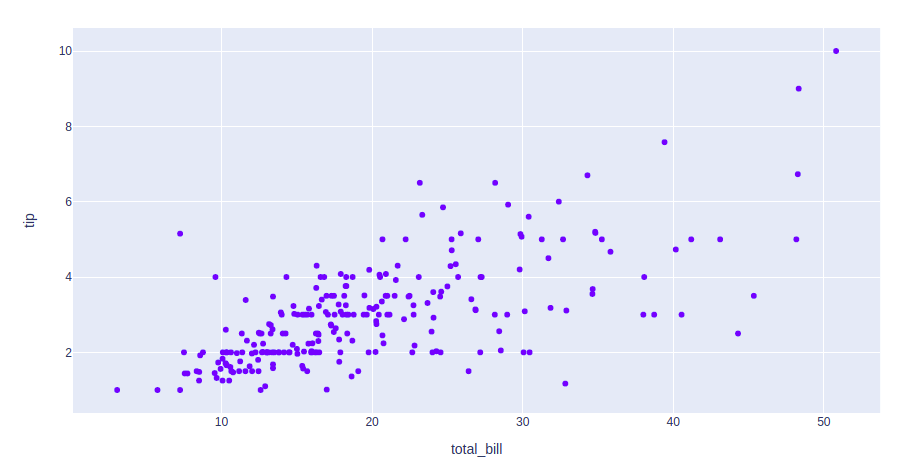
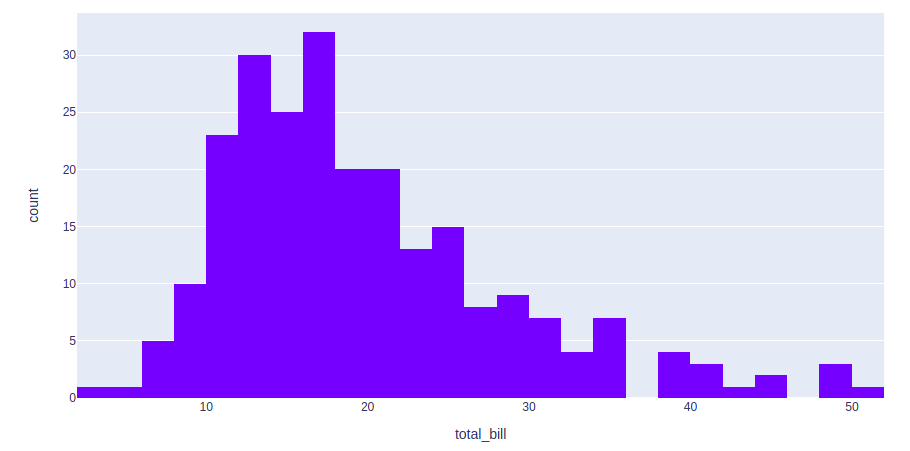
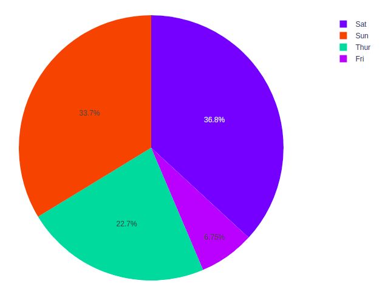
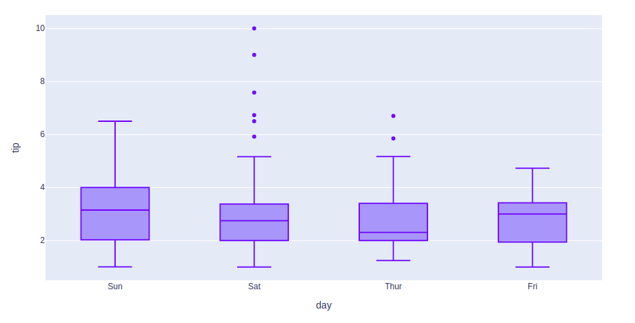

<h1 align="center">📊 Plotly Data Visualization in Python</h1>

<b>Interactive Data Visualization for Data Analysis, Analytics and Data Science</b>

Projeto focado na criação de visualizações interativas, modernas e informativas utilizando a biblioteca Plotly em Python.

<h2>📌 Visão Geral</h2>

Este repositório apresenta uma coleção de exemplos práticos de visualização de dados desenvolvidos com
<b>Plotly</b>, uma das bibliotecas mais utilizadas para criação de gráficos interativos no ecossistema Python.

O projeto é voltado para estudantes, analistas de dados e profissionais de Data Science que desejam
explorar diferentes tipos de gráficos e compreender quando e por que utilizá-los em análises reais.

<h2>🎯 Objetivos do Projeto</h2>

<ul>
  <li>Demonstrar boas práticas em visualização de dados</li>
  <li>Explorar gráficos interativos e responsivos</li>
  <li>Apoiar análises exploratórias (EDA)</li>
  <li>Servir como material de estudo e portfólio</li>
</ul>

<h2>📊 Tipos de Gráficos e Casos de Uso</h2>

<h3>📈 Line Chart (Gráfico de Linha)</h3>

O gráfico de linha é amplamente utilizado para representar <b>tendências ao longo do tempo</b>.
É essencial em análises de séries temporais, permitindo identificar padrões, sazonalidades e variações contínuas.

<i>Casos de uso comuns:</i> evolução de vendas, métricas de performance, preços de ativos financeiros.

<h3>📊 Bar Chart (Gráfico de Barras)</h3>

O gráfico de barras é ideal para <b>comparar valores entre categorias</b>.
Ele facilita a visualização de diferenças e rankings entre grupos distintos.

<i>Casos de uso comuns:</i> vendas por região, quantidade por produto, desempenho por equipe.

<h3>🔵 Scatter Plot (Gráfico de Dispersão)</h3>

O scatter plot permite analisar a <b>relação entre duas variáveis numéricas</b>.
É muito utilizado para identificar correlações, padrões, clusters e outliers.

<i>Casos de uso comuns:</i> análise exploratória, estudos estatísticos, validação de hipóteses.

<h3>📋 Histogram (Histograma)</h3>

O histograma representa a <b>distribuição de frequência</b> de uma variável numérica,
auxiliando na compreensão do comportamento dos dados e sua dispersão.

<i>Casos de uso comuns:</i> análise estatística, identificação de assimetrias e concentração de valores.

<h3>🥧 Pie Chart (Gráfico de Pizza)</h3>

O gráfico de pizza é utilizado para mostrar <b>proporções e participações percentuais</b>
de categorias em relação a um total.

<i>Casos de uso comuns:</i> participação de mercado, distribuição percentual de categorias.

<h3>📦 Box Plot (Gráfico de Caixa)</h3>

O box plot é uma ferramenta estatística poderosa para analisar <b>dispersão, mediana,
quartis e outliers</b>. Facilita comparações entre diferentes grupos de dados.

<i>Casos de uso comuns:</i> análise estatística comparativa, detecção de valores atípicos.

<h3>🎻 Violin Plot</h3>

O violin plot combina informações do box plot com a <b>densidade de probabilidade</b>,
permitindo uma análise mais detalhada da distribuição dos dados.

<i>Casos de uso comuns:</i> análises avançadas de distribuição, comparação de grupos.

<h3>🧊 3D Scatter Plot</h3>

O gráfico de dispersão 3D possibilita a visualização simultânea de <b>três variáveis</b>,
sendo extremamente útil em análises complexas e visualizações multidimensionais.

<i>Casos de uso comuns:</i> análise exploratória avançada, machine learning, visualização científica.

<h2>🛠️ Tecnologias Utilizadas</h2>

<ul>
  <li>Python</li>
  <li>Plotly</li>
  <li>Pandas</li>
</ul>

<h2>📂 Estrutura do Repositório</h2>

A pasta <b>Images/</b> contém todas as imagens e GIFs utilizados neste README,
facilitando a organização e manutenção do projeto.

<h2>👤 Público-Alvo</h2>

<ul>
  <li>Estudantes de Data Science</li>
  <li>Analistas de Dados</li>
  <li>Profissionais de Analytics</li>
  <li>Entusiastas de visualização de dados</li>
</ul>

<h2>📚 Referência</h2>

Este projeto foi inspirado no artigo:

<b>Using Plotly for Interactive Data Visualization in Python</b> 
GeeksforGeeks

<h2>📄 Licença</h2>

Projeto desenvolvido para fins educacionais e demonstrativos.
Livre para estudo, adaptação e aprendizado.

